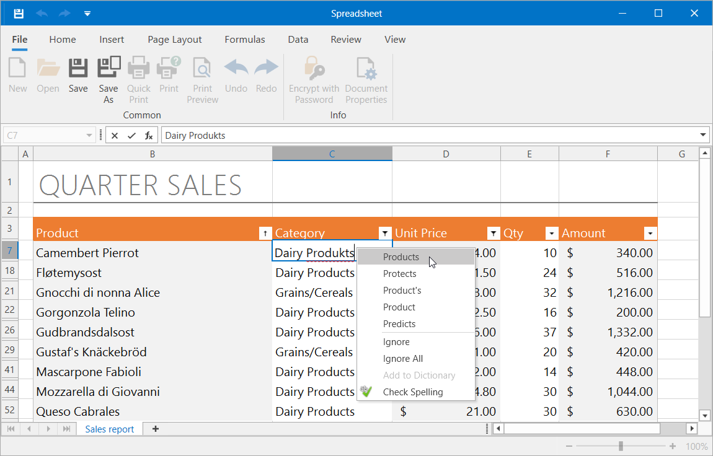

<!-- default badges list -->

[](https://docs.devexpress.com/GeneralInformation/403183)
<!-- default badges end -->
# Spreadsheet for WPF – Spell Check Text in a Cell Editor

This example demonstrates how to use the [DevExpress Spell Checker](https://docs.devexpress.com/WPF/8927/controls-and-libraries/spell-checker) component to check spelling in spreadsheet cells. When a user types text in a cell, the spell checker indicates misspelled words with a red wavy line. The user can right-click an underlined word and select the correct spelling from the list of suggestions or invoke the [Spelling dialog](https://docs.devexpress.com/WPF/8939/controls-and-libraries/spell-checker/visual-elements/spelling-dialog).



This example uses the default English dictionary to check cell text. Refer to the following help topic for information on how to add dictionaries for other languages to the Spell Checker: [Spell Checker Dictionaries](https://docs.devexpress.com/WPF/8945/controls-and-libraries/spell-checker/dictionaries).

## Implementation Details

Follow the steps below to integrate a spell checker into the Spreadsheet application:

1. Configure the Spreadsheet control’s [DXSpellChecker](https://docs.devexpress.com/WPF/DevExpress.Xpf.SpellChecker.DXSpellChecker) behavior in XAML:

    ```xaml
    <dxsps:SpreadsheetControl>
         <mvvm:Interaction.Behaviors>
                <local:SpreadsheetSpellChecker 
                    CheckAsYouType="True" 
                    ShowSpellCheckMenu="True" 
                    Culture="en-US" />
         </mvvm:Interaction.Behaviors>
    </dxsps:SpreadsheetControl>
    ```

2. Call the [SpellingSettings.RegisterTextControl](https://docs.devexpress.com/WPF/DevExpress.Xpf.SpellChecker.SpellingSettings.RegisterTextControl(System.Type)) method to enable spell check for the control used as the default cell editor (the [System.Windows.Controls.TextBox](https://docs.microsoft.com/en-us/dotnet/api/system.windows.controls.textbox) descendant). See this topic for details: [Register Custom Control to Enable Spell Checking](https://docs.devexpress.com/WPF/120354/controls-and-libraries/spell-checker/examples/how-to-register-custom-control-to-enable-spell-checking).

    ```
    SpellingSettings.RegisterTextControl(typeof(XpfCellInplaceEditor));
    ```

3. Handle the [SpreadsheetControl.CellEditorOpened](https://docs.devexpress.com/WPF/DevExpress.Xpf.Spreadsheet.SpreadsheetControl.CellEditorOpened) event to access the active cell editor. Use the [SpellChecker.Check](https://docs.devexpress.com/WPF/DevExpress.Xpf.SpellChecker.SpellChecker.Check(System.Windows.Controls.Control)) method to check text in the editor.

4. Handle the [SpellChecker.CheckCompleteFormShowing](https://docs.devexpress.com/WPF/DevExpress.Xpf.SpellChecker.SpellChecker.CheckCompleteFormShowing) event to suppress the appearance of this dialog box: **Spell check is complete**.

<!-- default file list -->
## Files to Look At

* [MainWindow.xaml](./CS/MainWindow.xaml) (VB: [MainWindow.xaml](./VB/MainWindow.xaml))

* [SpreadsheetSpellChecker.cs](./CS/SpreadsheetSpellChecker.cs) (VB: [SpreadsheetSpellChecker.vb](./VB/SpreadsheetSpellChecker.vb))
<!-- default file list end -->
